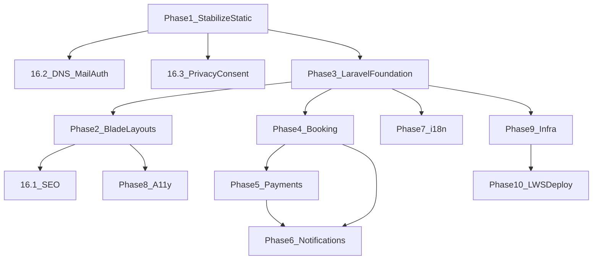

# Step-by-step implementation of [plan.txt](plan.txt)

This sequence follows the roadmap’s phases (1 → 2 → 3 → 4 → 5 → 6 → 7 → 8 → 9 → 10) plus **Section 16** items integrated at the points where they matter most. **Laravel paths** assume a new app root (e.g. `laravel/` or repo re-root); adjust if you keep the static site in a subfolder during transition.

**Current codebase touchpoints (static + PHP):** [`index.html`](index.html), [`about.html`](about.html), [`service.html`](service.html), [`contact.html`](contact.html), [`tarif.html`](tarif.html), [`controle.html`](controle.html), [`email.php`](email.php), [`js/main.js`](js/main.js), [`js/components.js`](js/components.js), [`js/index.js`](js/index.js), [`js/form-script.js`](js/form-script.js), [`js/contact-form.js`](js/contact-form.js), [`css/style.css`](css/style.css), [`translations/fr/accueil.js`](translations/fr/accueil.js), [`translations/en/home.js`](translations/en/home.js), plus template pages [`404.html`](404.html), [`booking.html`](booking.html), [`team.html`](team.html), [`testimonial.html`](testimonial.html), [`actualite.html`](actualite.html), [`rejoindre.html`](rejoindre.html), [`assets/php/`](assets/php/), [`PHPMailer/`](PHPMailer/), [`forms.php`](forms.php) (likely remove after audit).

---

## Phase 1 — Stabilization and security hardening (1–2 weeks)

**Goal:** Fix critical issues on the **current** site before structural migration.

| Step | What to do | Files to modify / create |
|------|----------------|---------------------------|
| 1.1 | **Remove secrets from source**; load mail config from environment or a **gitignored** config (rotate any exposed credentials). | **Modify:** [`email.php`](email.php). **Create:** `.env.example` (or `config/email.example.php`) documenting required vars; **create:** `.env` (gitignored) on each environment. **Do not commit** real passwords. |
| 1.2 | **Mail sending semantics:** use a fixed `From` (site domain), `Reply-To` visitor email; align field names with [`contact.html`](contact.html) POST body. | **Modify:** [`email.php`](email.php), optionally [`contact.html`](contact.html) if you add CSRF/token fields later. |
| 1.3 | **HTTPS:** enable SSL at host/Cloudflare; add **301** HTTP→HTTPS redirect (Apache `.htaccess` or equivalent on LWS). | **Create/modify:** `.htaccess` at web root (or host panel only). |
| 1.4 | **Security headers:** CSP (start report-only if needed), `X-Frame-Options`, `X-Content-Type-Options`, `Strict-Transport-Security`, `Referrer-Policy`. | **Modify:** same `.htaccess` or nginx/host rules; if only PHP entrypoints, **new** `security-headers.php` include—prefer edge/host headers. |
| 1.5 | **Anti-spam:** reCAPTCHA or Turnstile + honeypot + basic rate limit (session/IP) on contact POST. | **Modify:** [`contact.html`](contact.html), [`email.php`](email.php) (server-side verify). **Create:** small `verify-captcha.php` or merge into `email.php`. |
| 1.6 | **Fix broken JS:** null-safe `#switchlangue` in [`js/index.js`](js/index.js); guard `#topbar`/`#navbar`/`#footer` in [`js/components.js`](js/components.js); align or remove [`js/form-script.js`](js/form-script.js) vs native POST on contact. | **Modify:** [`js/index.js`](js/index.js), [`js/components.js`](js/components.js), [`contact.html`](contact.html) (script list). |
| 1.7 | **Dead code removal:** delete or archive unused PHP/JS (e.g. [`forms.php`](forms.php), broken [`assets/php/`](assets/php/) paths, commented Cloudflare blocks in HTML). | **Modify/delete:** audited files only after `grep`/usage check. |
| 1.8 | **HTML hygiene:** fix stray markup (e.g. footer typos), broken comments, wrong social `href`/icon pairs on [`contact.html`](contact.html). | **Modify:** affected `*.html`. |

**Section 16 in parallel with Phase 1**

- **16.2 DNS mail (SPF/DKIM/DMARC):** document and apply at DNS provider (no repo file unless you add `docs/dns-mail.md`). **Create:** `docs/dns-mail-auth.md` (operational runbook).
- **16.3 Privacy / consent:** cookie banner + policy pages (static first). **Create:** `privacy.html` (or future Blade), `cookies.html`; **modify:** each page that loads GA to load only after consent.
- **16.4 Quality gates (bootstrap):** add a minimal CI config (GitHub Actions or other). **Create:** `.github/workflows/ci.yml` (Lighthouse or link checker on `main`).

---

## Phase 2 — Remove duplicated layouts (1–2 weeks)

**Goal:** One navbar/footer/topbar—**after** Laravel exists, this is Blade; *before* Laravel you may do a short interim (PHP includes or fix `components.js` only), but the plan targets Blade.

| Step | What to do | Files |
|------|------------|--------|
| 2.1 | **Decision:** either (A) create Laravel app now and move chrome into Blade, or (B) interim PHP `include` partials on LWS—plan prefers Laravel in next phase; minimal path is start Phase 3 then return here. | **New Laravel tree** (Phase 3) first if following plan strictly. |
| 2.2 | Extract shared chrome from [`index.html`](index.html) / [`about.html`](about.html) / [`contact.html`](contact.html) into Blade partials. | **Create:** `resources/views/layouts/app.blade.php`, `resources/views/partials/topbar.blade.php`, `resources/views/partials/navbar.blade.php`, `resources/views/partials/footer.blade.php`. **Modify:** each migrated page Blade. |
| 2.3 | Retire [`js/components.js`](js/components.js) injection for pages served by Laravel (or keep only for legacy static mirror during cutover). | **Modify:** [`js/components.js`](js/components.js) usage in remaining static pages until none left. |

**Section 16.1 (SEO baseline) during Blade extraction**

- **Create:** `public/robots.txt`, sitemap generator route or `public/sitemap.xml` build step; per-page `@section('meta')` in layout; JSON-LD partial. **Modify:** layout + each page Blade.

---

## Phase 3 — Laravel foundation (2–4 weeks)

| Step | What to do | Files / artifacts |
|------|------------|---------------------|
| 3.1 | `composer create-project laravel/laravel` (LTS), configure app name, timezone **Africa/Douala**, locale `fr`. | **New:** full Laravel skeleton (`app/`, `routes/`, `config/`, `database/migrations/`, etc.). |
| 3.2 | **Environment:** `APP_ENV`, `APP_DEBUG=false` prod, `APP_URL`, database DSN, queue `database`, mail from `.env`. | **Create:** `.env`, `.env.example`; **modify:** `config/app.php`, `config/database.php`, `config/mail.php`, `config/queue.php`. |
| 3.3 | **Migrations** for core tables from plan: `users`, `bookings`, `payments`, `notifications` (and optional `languages`/`translations` if not using file-only i18n). | **Create:** `database/migrations/*_create_users_table.php`, `*_create_bookings_table.php`, `*_create_payments_table.php`, `*_create_notifications_table.php`. |
| 3.4 | **Auth scaffolding** (Breeze/Jetstream or Fortify) if staff/admin will log in. | **Create/modify:** `routes/web.php`, `app/Models/User.php`, auth views/controllers as chosen. |
| 3.5 | **Port static routes** to Laravel: home, about, services, contact, tarif, controle, etc. | **Create:** `routes/web.php` routes; **create:** `resources/views/pages/*.blade.php`; **modify:** move assets to `public/` or `resources` + Vite/Mix as you prefer. |
| 3.6 | **Contact form** as Laravel `FormRequest` + Mailable + queue job. | **Create:** `app/Http/Controllers/ContactController.php`, `app/Mail/ContactSubmitted.php`, `app/Jobs/SendContactMail.php`, `resources/views/emails/contact.blade.php`. **Modify:** contact Blade form `action` to POST route. |

**Section 16.6 (locale rules) — decide now**

- Document: FCFA display, `Carbon` timezone, store booking instants in **UTC** with `inspection_center` for display conversion. **Create:** `docs/locale-and-money.md`; **modify:** migrations (datetime columns), `config/app.php`.

---

## Phase 4 — Online booking (2–5 weeks)

| Step | What to do | Files |
|------|------------|--------|
| 4.1 | Model `Booking` + statuses; validation (center, date, slot). | **Create:** `app/Models/Booking.php`, `app/Http/Controllers/BookingController.php`, `app/Http/Requests/StoreBookingRequest.php`. |
| 4.2 | **Customer flow:** center list, calendar/slot UI (reuse Bootstrap). | **Create:** `resources/views/booking/*.blade.php`, JS if needed under `resources/js/`. |
| 4.3 | **Admin:** approve/cancel/reschedule (policy + middleware `can:manage-bookings`). | **Create:** `app/Http/Controllers/Admin/BookingController.php`, `resources/views/admin/bookings/*.blade.php`, `app/Policies/BookingPolicy.php`. |
| 4.4 | Wire **notifications** (email at minimum) on state transitions—feeds Phase 6 early. | **Create:** `app/Notifications/BookingConfirmed.php` (etc.), queue migration if not present. |

---

## Phase 5 — Payment system (2–4 weeks)

| Step | What to do | Files |
|------|------------|--------|
| 5.1 | **Payment service layer** interface + provider classes (MTN MoMo, Orange Money stubs first). | **Create:** `app/Services/Payments/PaymentService.php`, `app/Services/Payments/MTNMoMoProvider.php`, `app/Services/Payments/OrangeMoneyProvider.php`. |
| 5.2 | Webhooks/callback routes; persist `payments` linked to `bookings`. | **Create:** `routes/api.php` or `routes/web.php` callback routes; **create:** `app/Http/Controllers/PaymentWebhookController.php`. |
| 5.3 | **Secrets** per provider in `.env`; idempotency keys for webhooks. | **Modify:** `.env.example`, `config/services.php`. |

---

## Phase 6 — Notifications (2–3 weeks)

| Step | What to do | Files |
|------|------------|--------|
| 6.1 | Queue all outbound email; add SMS provider adapter (Twilio or local SMS API) behind interface. | **Create:** `app/Services/Sms/SmsSender.php`, implementation class; **modify:** `config/queue.php`, supervisor/cron on LWS for `queue:work`. |
| 6.2 | **Database queue** worker docs for LWS cron (shared hosting limitation). | **Create:** `docs/lws-queue-cron.md`. |

---

## Phase 7 — FR/EN multilingual (1–2 weeks)

| Step | What to do | Files |
|------|------------|--------|
| 7.1 | Replace legacy [`translations/*.js`](translations/) approach with Laravel `lang/fr/*.php`, `lang/en/*.php`. | **Create:** `lang/fr/messages.php`, `lang/en/messages.php`; **delete** or stop loading old JS dictionaries when Blade migration complete. |
| 7.2 | **Prefix routes** `/fr/...`, `/en/...` (route group + middleware `SetLocale`). | **Modify:** `routes/web.php`; **create:** `app/Http/Middleware/SetLocale.php`, register in `bootstrap/app.php` or `Kernel`. |
| 7.3 | **Canonical + hreflang** for SEO (ties to 16.1). | **Modify:** layout Blade `<head>`. |

---

## Phase 8 — Accessibility (ongoing)

| Step | What to do | Files |
|------|------------|--------|
| 8.1 | Audit with axe/Lighthouse; fix focus order, labels, contrast in shared layout and forms. | **Modify:** `resources/views/layouts/app.blade.php`, form Blades, [`css/style.css`](css/style.css) or `resources/sass`. |
| 8.2 | Add skip links, landmark regions, live regions for validation errors. | **Modify:** layout + form components. |

---

## Phase 9 — Infrastructure hardening (ongoing)

| Step | What to do | Files / systems |
|------|------------|------------------|
| 9.1 | **Cloudflare:** SSL mode, WAF rules, caching rules for static assets, Page Rules for Laravel `/public`. | Mostly **external**; **optional** `docs/cloudflare-settings.md`. |
| 9.2 | **Backups:** automated DB dump + file backup to remote object storage. | **Create:** `scripts/backup.sh` + cron doc; host panel schedules. |
| 9.3 | **Monitoring:** UptimeRobot checks; GA4 conversions for booking funnel. | **External**; **modify:** Blade for GA snippet + consent (16.3). |
| 9.4 | **Logging:** `LOG_CHANNEL=stack` + optional Sentry/Bugsnag. | **Modify:** `config/logging.php`, `.env.example`. |

---

## Phase 10 — Deployment on LWS (aligned with go-live)

| Step | What to do | Files |
|------|------------|--------|
| 10.1 | Point vhost to `public/` or use **document root workaround** (symlink / `index.php` front controller pattern per LWS docs). | **Create/modify:** host-specific `public/index.php` / `.htaccess` as required. |
| 10.2 | Production optimizations: `php artisan config:cache`, `route:cache`, `view:cache`. | **Document** in `docs/deploy-lws.md`; run on server post-deploy. |
| 10.3 | **Staging** subdomain mirroring prod `.env` structure with `APP_DEBUG=false`. | **New env** on host; optional second deployment path. |

---

## Phase 15 — Future scaling (when needed)

- Move queue to **Redis**, add **Horizon**, consider **VPS** when shared hosting limits bite.
- **API + mobile:** `routes/api.php`, Sanctum/Passport, versioned API.
- **Files:** new `app/Http/Controllers/Api/*`, `app/Models/*`, API resources.

---

## Section 16 — Cross-cutting (mapped to phases above)

| Section | Primary phase | Key deliverables |
|---------|----------------|------------------|
| 16.1 SEO | 2–3 | `robots.txt`, sitemap, meta/OG/JSON-LD in layout |
| 16.2 SPF/DKIM/DMARC | 1 (with mail) | DNS + `docs/dns-mail-auth.md` |
| 16.3 Privacy/consent | 1, 9 | policy pages, consent-gated GA |
| 16.4 CI / Lighthouse | 1+ | `.github/workflows/*.yml` |
| 16.5 CMS / admin | After 4–5 or when needed | Filament/Nova or custom admin package |
| 16.6 Locale/money/time | 3–5 | docs + migrations + `Number::currency` / `Carbon` usage |

---

## Dependency overview (order matters)

---

## Summary: new vs modified (high level)

**Heavily modified early:** [`email.php`](email.php), [`contact.html`](contact.html), [`js/index.js`](js/index.js), [`js/components.js`](js/components.js), [`.htaccess`](.htaccess) (new), all `*.html` eventually replaced by Blade during Phase 3–7.

**New (major buckets):** entire **Laravel application tree**; **migrations** for users/bookings/payments/notifications; **Blade** layouts/partials/pages; **controllers**, **FormRequests**, **Mail/Notification** classes; **payment service** layer; **middleware** for locale; **docs** for DNS, LWS deploy, queue cron, locale; **CI workflow**; optional **Filament/Nova** later; **privacy/cookie** pages.

**Removed/archived after migration:** redundant static `*.html` (keep redirects), [`js/components.js`](js/components.js) if unused, legacy [`translations/*.js`](translations/) when i18n is Laravel-native, [`forms.php`](forms.php) if confirmed unused.

This is a multi-month program if done sequentially; the roadmap’s durations (weeks per phase) assume focused execution and may overlap (e.g. 16.x and Phase 8) with staffing.
