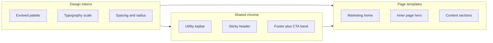
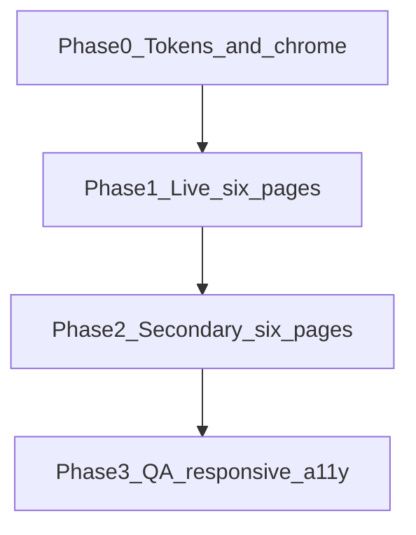

# Professional frontend redesign (static site)

## Your choices (locked in)

| Decision | Choice |
|----------|--------|
| Brand | **Evolve** red/navy slightly (same identity, modern tones) |
| Timing | **Redesign static HTML/CSS now**, before Laravel |

## Constraints (non-negotiable)

- **In scope:** Visual design, layout structure, CSS, markup classes, imagery treatment, typography, spacing, responsive behavior, shared chrome consistency.
- **Out of scope:** New features, booking/payment logic, [`email.php`](email.php) behavior, form `action`/field names, route URLs, translation/i18n architecture, Laravel migration.
- **Content:** Keep existing French copy, prices, phone numbers, maps, and section topics unless a layout change requires reordering blocks (not rewriting text).

---

## Current state (why it feels unprofessional)

The site is built on the **CarServ / HTMLCodex auto-repair template** ([`css/style.css`](css/style.css): red `#D81324`, navy `#0B2154`, Barlow/Ubuntu). That reads as “garage theme,” not **accredited vehicle inspection / homologation** (regulatory trust).

| Issue | Impact |
|-------|--------|
| Two chrome systems: inline nav on 6 live pages vs [`js/components.js`](js/components.js) on stubs | Inconsistent brand; JS errors when `components.js` loads without `#topbar` placeholders |
| Template residue | `// Label //` eyebrows, uppercase nav, heavy WOW animations, stock “CarServ” on [`testimonial.html`](testimonial.html) |
| Asset/head bloat | 5–6 Font Awesome CDNs per page; duplicate icon families |
| Visual bugs | Logo `../img/logo-sn.png` on root pages; footer social icon/URL swaps; stray `"` in copyright |
| IA clutter | [`index.html`](index.html) (~900 lines) duplicates about/service/team blocks; [`service.html`](service.html) ≈ index tab section |
| Empty shells | [`actualite.html`](actualite.html), [`rejoindre.html`](rejoindre.html) — nav chrome only |
| Weak secondary pages | [`controle.html`](controle.html) zigzag text walls; [`contact.html`](contact.html) fixed-width map iframes |

**Live pages (priority):** [`index.html`](index.html), [`about.html`](about.html), [`service.html`](service.html), [`controle.html`](controle.html), [`tarif.html`](tarif.html), [`contact.html`](contact.html)

**Secondary (same design system, lower content priority):** [`booking.html`](booking.html), [`team.html`](team.html), [`testimonial.html`](testimonial.html), [`404.html`](404.html), [`actualite.html`](actualite.html), [`rejoindre.html`](rejoindre.html)

---

## Design direction: “Regulatory trust,” not “auto shop”

Position Satellite Ngono as **official, accredited, multi-center inspection** — calm, structured, credible (similar tone to government transport / ISO-adjacent services, not flashy repair shops).



### Evolved palette (from current tokens)

Update [`css/style.css`](css/style.css) `:root` — keep recognizable brand, refine for contrast and whitespace:

| Token | Current | Proposed |
|-------|---------|----------|
| `--primary` | `#D81324` | `#C41020` (slightly deeper red) |
| `--primary-hover` | — | `#A30D1A` |
| `--secondary` | `#0B2154` | `#0A1A45` (richer navy) |
| `--accent` | — | `#1E4FD8` (links, map pins — sparingly) |
| `--surface` | `#F2F2F2` | `#F7F8FA` |
| `--surface-elevated` | white | `#FFFFFF` + subtle shadow |
| `--text` | `#111111` | `#1A1D26` |
| `--text-muted` | ad hoc grays | `#5C6370` |
| `--border` | — | `#E2E6ED` |
| `--success` | — | `#0D7A4E` (badges: “Agréé”, validity dates) |

Bootstrap utility classes (`text-primary`, `btn-primary`) continue to work via updated CSS variables / overrides.

### Typography

- **Headings:** Replace Barlow with **DM Sans** or **Plus Jakarta Sans** (600/700) — geometric, institutional.
- **Body:** **Source Sans 3** or keep **Ubuntu** at 400/500 for readability in long French paragraphs.
- **Remove:** `text-transform: uppercase` on all nav/buttons; use sentence case + semibold for nav.
- **Scale:** Define `--text-xs` through `--text-3xl` and section title pattern: small label (no `// slashes //`) + `h2` + optional lead paragraph.

### Spacing, radius, motion

- Section rhythm: `py-5` → consistent `section` class with `padding-block: clamp(3rem, 6vw, 5rem)`.
- Cards: `border-radius: 12px`, light border + shadow (replace flat template boxes).
- **Reduce motion:** Keep WOW optional or disable on `prefers-reduced-motion`; shorten carousel auto-play; drop spinner on repeat visits (CSS-only hide after first paint is acceptable as visual polish).

### Iconography

- **One** icon set: Font Awesome 6 only (remove v4/v5/duplicate CDN links from all HTML `<head>` blocks).
- Replace Flaticon steering-wheel tabs with consistent FA icons or simple numbered steps.

---

## Shared chrome redesign (all 12 pages)

Unify markup visually across inline pages and [`js/components.js`](js/components.js) stubs.

### Topbar
- Full-width **navy bar** (not empty left column): address + hours left; phone + compact social icons right.
- Social: icon matches URL (fix LinkedIn/YouTube swap on production footers/topbars).

### Header / navbar
- White header, **1px bottom border**, subtle shadow on scroll (keep sticky behavior).
- Logo: `img/logo-sn.png` at consistent height (~48px), wordmark optional: “Satellite Ngono” in `--secondary`.
- Nav: 6 live links, active state = bottom border or pill, not red text only.
- **CTA button:** “Prendre rendez-vous” → [`contact.html`](contact.html) (visual only; same destination as today’s contact intent).
- Language widget (ConveyThis): move **outside** `<nav>` (valid HTML); style as compact globe + FR/EN in header right.

### Footer
- **Three-tier footer:** (1) dark navy block — 4 agency cities + hours aligned with index; (2) newsletter row; (3) copyright bar.
- Remove HTMLCodex / CarServ credits from [`js/components.js`](js/components.js) footer template.
- Fix malformed copyright `"` artifacts.

### Inner page hero (`page-header`)
- Shorter hero (40–50vh max), solid overlay using brand navy (not heavy stock photo blur everywhere).
- Breadcrumb: readable contrast; fix “Controle” → “Contrôle” in labels only where it’s visible UI text (typo fix is copy presentation, not new content).

### `components.js` alignment (design-only fixes)
- Match production FR nav/footer HTML strings in [`js/components.js`](js/components.js).
- Add null guards before `insertAdjacentHTML` (prevents console errors on inline pages that still load the script).
- Remove `alert()` on nav click (broken UX; no functional change to navigation).
- Fix logo path to `img/logo-sn.png`.

---

## Page-by-page design plan

### 1. [`index.html`](index.html) — Accueil
**Goal:** Shorter, scannable homepage; one clear story arc.

| Section | Redesign |
|---------|----------|
| Hero | Single strong hero (or 2-slide max carousel) with headline on accreditation + CTA pair: “Voir les tarifs” / “Nous contacter”; overlay gradient for text legibility |
| Agencies | **Card grid** (2×2) with city, address snippet, hours badge — replace alternating full-width rows |
| About teaser | One column text + image; link “En savoir plus” → about (remove duplicate full about block) |
| Stats (`fact`) | Horizontal stat bar on navy, large numbers, short labels — not full-bleed stock photo |
| Services | **6-card grid** with icon, title, 2-line summary, “Détails” → [`controle.html`](controle.html)#anchor — remove heavy pill tabs duplicating service page |
| Mobile unit | Highlight card with image + bullet list |
| Team | Compact 5-card row; hover = subtle lift, not full red overlay scale |
| Clients | Logo strip (grayscale → color on hover); simplify Owl config |
| Booking band | Keep CTA band visually but style as navy **callout** (form stays commented if today) |

### 2. [`about.html`](about.html) — À propos
- Dedicated story layout: timeline or “17 années” badge integrated in hero.
- Team + testimonials: reuse **home card components** — avoid repeating index verbatim.
- Remove self-referential “Voir plus” → about loops.

### 3. [`service.html`](service.html) — Services
- Replace left pill nav with **horizontal scroll chips** on mobile, vertical list on desktop.
- Tab panes: consistent image aspect ratio (16:9), typographic hierarchy, “En savoir plus” styled as text link with arrow.
- Remove broken/commented duplicate booking block at bottom (visual cleanup).

### 4. [`controle.html`](controle.html) — Contrôle technique
- Wrap content in `container-xxl` for alignment with other pages.
- Each test (`#ripage`, etc.): **feature row** component — icon badge, `h3`, short intro, collapsible “Lire la suite” for long text (accordion = presentation only; text unchanged, collapsed by default).
- Sticky **table of contents** on desktop linking to anchors.

### 5. [`tarif.html`](tarif.html) — Tarifs
- **Pricing cards** uniform height: category image, title, price prominent (FCFA), validity pill in `--success`.
- Fix page `<title>` mismatch (presentation).
- Grid: 3 columns desktop; orphan last card spans or pairs in 2-col row.
- Optional comparison note banner at top (existing legal/homologation text, restyled).

### 6. [`contact.html`](contact.html) — Contact
- City cards: icon header, click-to-call tel links, responsive **16:9 map embeds** (`width: 100%`, `max-width`, `aspect-ratio`).
- Form: grouped fields, clear labels (keep `form-floating` or switch to top labels for a11y), primary submit unchanged (`email.php`).
- Fix visible typo “danas” → “dans” if present in static copy.

### 7–12. Secondary pages
Apply same chrome + inner hero; minimal body until content exists:

| Page | Design treatment |
|------|------------------|
| [`booking.html`](booking.html) | FR labels, same booking band styling; keep datetime picker markup |
| [`team.html`](team.html) | Use real team names/images from index where available; drop “Full Name” placeholders |
| [`testimonial.html`](testimonial.html) | Replace CarServ navbar with unified chrome; FR carousel styling |
| [`404.html`](404.html) | FR copy, CTA → `index.html`, illustration/icon on brand navy |
| [`actualite.html`](actualite.html), [`rejoindre.html`](rejoindre.html) | **Placeholder state:** centered empty state (“Bientôt disponible”) with consistent layout — not blank footer-to-nav |

---

## Implementation architecture (files)

### New / primary CSS structure

Keep Bootstrap 5 ([`css/bootstrap.min.css`](css/bootstrap.min.css)); refactor custom styles:

```
css/
  tokens.css      # :root variables, typography imports
  components.css  # buttons, cards, section-header, hero, footer, nav
  pages.css       # page-specific overrides (tarif grid, contact maps)
  style.css       # imports above + legacy overrides during migration
```

Alternatively, a single expanded [`css/style.css`](css/style.css) if you prefer fewer HTTP requests on LWS hosting.

### HTML changes (all pages)
- Standardize `<head>`: one font link, one FA6 link, drop duplicate icon CDNs.
- Set `lang="fr"` on French pages.
- Apply shared class names: `sn-topbar`, `sn-header`, `sn-section`, `sn-card`, `sn-hero`, `sn-footer`.
- Fix `src="img/logo-sn.png"` on all root pages.

### JS (visual safety only)
- [`js/components.js`](js/components.js): sync chrome HTML + null guards.
- Do **not** change [`js/form-script.js`](js/form-script.js), [`js/contact-form.js`](js/contact-form.js), [`email.php`](email.php) submission contract.

### Images
- Prefer WebP with JPEG fallback for heroes and team photos under [`img/`](img/).
- Consistent aspect ratios; `object-fit: cover` in cards.

---

## Phased rollout (recommended order)



| Phase | Deliverable | Pages / files |
|-------|-------------|---------------|
| **0** | Design tokens, shared chrome, head cleanup, `components.js` sync | `css/*`, all HTML heads, `js/components.js` |
| **1** | Full visual redesign | index, about, service, controle, tarif, contact |
| **2** | Secondary pages + empty states | booking, team, testimonial, 404, actualite, rejoindre |
| **3** | QA: mobile 375/768/1280, contrast WCAG AA on text, keyboard nav, fix remaining visual bugs | cross-page pass |

**Estimated effort:** 2–3 weeks focused design/dev (Phase 0–1 ~1 week, Phase 2–3 ~1–2 weeks).

---

## Success criteria (how we know it’s “professional”)

- Single coherent chrome on every page; no CarServ/English template visible.
- Evolved red/navy feels modern; generous whitespace; no `// Section //` trope.
- Homepage length reduced ~30–40% while keeping all information reachable via links.
- Tarifs and contact pages look credible for a regulated service (clear prices, responsive maps, trustworthy footer).
- Lighthouse **Performance** and **Accessibility** improve (fewer CSS requests, contrast, landmarks).
- Zero regression: contact form still POSTs to [`email.php`](email.php); all existing `href`s and anchors work.

---

## Relationship to Laravel plan

This redesign **front-loads** the visual system you will later port to Blade (`resources/views/layouts/app.blade.php`). Document final CSS variables in a short `docs/design-tokens.md` (optional) so Phase 2 of the Laravel roadmap reuses the same classes/tokens.

---

## Optional follow-ups (not in this redesign scope)

- Professional photo shoot / illustrated icons
- Re-enable [`actualite.html`](actualite.html) and [`rejoindre.html`](rejoindre.html) in nav when content exists
- Blade extraction of chrome (post-redesign)
