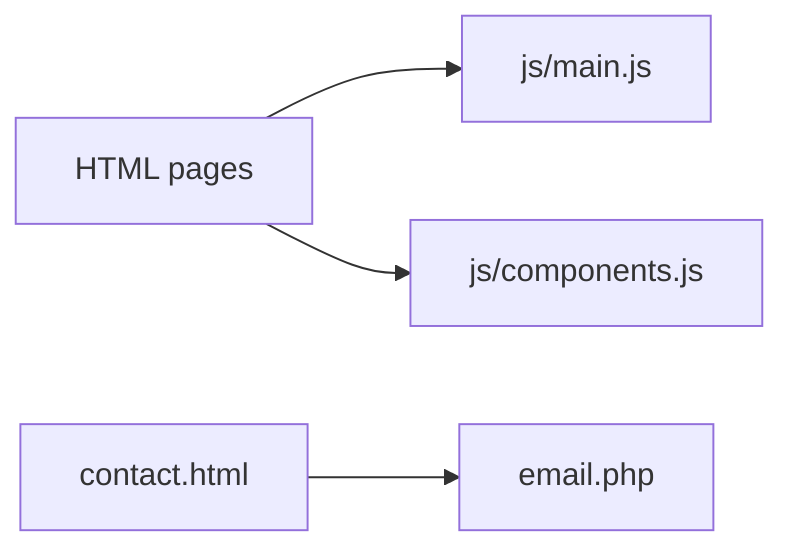

# Safe strong improvements (choose one track)

## Context

The codebase is a multi-page static site ([`index.html`](index.html), [`contact.html`](contact.html), etc.) with [`js/main.js`](js/main.js), optional layout injection in [`js/components.js`](js/components.js), and mail handling in [`email.php`](email.php) + [`PHPMailer/`](PHPMailer/). There is no bundler or app framework.

---

## Track A — Security and mail hygiene (highest priority for production)

**What:** Remove hardcoded SMTP credentials from [`email.php`](email.php) (they are currently in the repo and are a critical exposure). Load `Host`, `Username`, `Password`, `Port`, and recipient from environment variables (e.g. `getenv('SMTP_USER')`) or a **gitignored** local config file; add a `.env.example` (or `email.config.example.php`) with empty placeholders and short setup notes. Rotate the exposed Gmail app password immediately if this repo was ever shared or public. Optionally tighten mail headers: `setFrom` a fixed site address, `replyTo` the visitor’s email (instead of `setFrom` the visitor, which can hurt deliverability and abuse reputation).

**Tradeoffs:** Low risk to the static front-end; requires server/hosting that can set env vars or a private config file. Slightly more deploy steps. Does not by itself fix front-end JS issues.

---

## Track B — JavaScript reliability (quick wins, low blast radius)

**What:**

1. **Harden [`js/components.js`](js/components.js):** Only call `insertAdjacentHTML` if `document.querySelector("#topbar")` (and same for `#navbar`, `#footer`) exists. Prevents runtime errors on pages like [`contact.html`](contact.html) that load `components.js` but have no placeholders (confirmed: no `id="topbar|navbar|footer"` in that file).
2. **Align or remove [`js/form-script.js`](js/form-script.js):** It expects `#contactForm` and `.validator()` (Bootstrap validator) and posts to `assets/php/form-process.php`, while [`contact.html`](contact.html) uses a plain form with `method="post" action="email.php"`. Either remove `form-script.js` from [`contact.html`](contact.html) or wire one coherent path (native POST vs Ajax).
3. **Harden [`js/index.js`](js/index.js):** If `#switchlangue` is missing, exit early (no `addEventListener` on null). Optionally add the missing markup on the home page or stop loading `index.js` until i18n is real.

**Tradeoffs:** Small diffs, immediate reduction in console errors. Does not unify duplicated nav/footer across pages; does not address secrets.

---

## Track C — HTML and content correctness

**What:** Fix visible/structural issues: stray characters in footers (e.g. a lone `"` in copyright blocks on [`index.html`](index.html) and [`contact.html`](contact.html) around the “All Right Reserved” line). On [`contact.html`](contact.html), social links appear misaligned with icons (e.g. LinkedIn vs YouTube `href` / icon class mismatch in the footer block). Uncommented/broken HTML comments in map iframe sections if any affect layout.

**Tradeoffs:** Editorial and QA work; no new infrastructure. Easy to combine with Track B.

---

## Track D — Single source of truth for chrome (nav / topbar / footer)

**What:** Pick one pattern: (1) every page uses empty `#topbar` / `#navbar` / `#footer` and **only** [`js/components.js`](js/components.js) (one string template to edit), or (2) remove `components.js` from pages that already inline the full layout. Optionally extract shared fragments into small HTML files and use a tiny static build (e.g. one `npm` script with `npx` include) or server-side includes—only if you accept tooling.

**Tradeoffs:** Best long-term maintainability for global chrome. Option (1) is medium HTML churn across many files. Option (2) is simpler but duplicated content remains. Build/SSI adds dependency or server config.

---

## Track E — Dependencies and performance (incremental)

**What:** Reduce duplicate Font Awesome / multiple jQuery-era CDNs in [`index.html`](index.html) head; keep one Bootstrap Icons + one Font Awesome major version where possible. Add `integrity` + `crossorigin` on remaining CDN scripts that lack them. Lazy-load non-critical widgets if needed.

**Tradeoffs:** Risk of subtle icon/CSS regressions if classes differ across versions; testing needed. Cleaner pages and slightly better security posture on CDN subresource integrity.

---

## Track F — Deletion and dead code

**What:** Remove or archive unused template artifacts: [`forms.php`](forms.php) (references undefined DB layer), [`forms.py`](forms.py) if unused, commented Cloudflare / `mail/` script blocks in [`contact.html`](contact.html), and [`js/contact-form.js`](js/contact-form.js) if permanently unused—**after** confirming nothing references them.

**Tradeoffs:** Low risk if grep confirms no references; avoids confusion for future contributors.

---

## Suggested default if you pick only one

**Track A** if the site is or will be public—credential exposure outweighs other issues. **Track B** if you want the fastest visible stability fix in the browser without touching hosting.

---

## What I need from you

Reply with **one primary track** (A–F), or a **small combo** (e.g. “B + C”). I will not implement until you choose.
